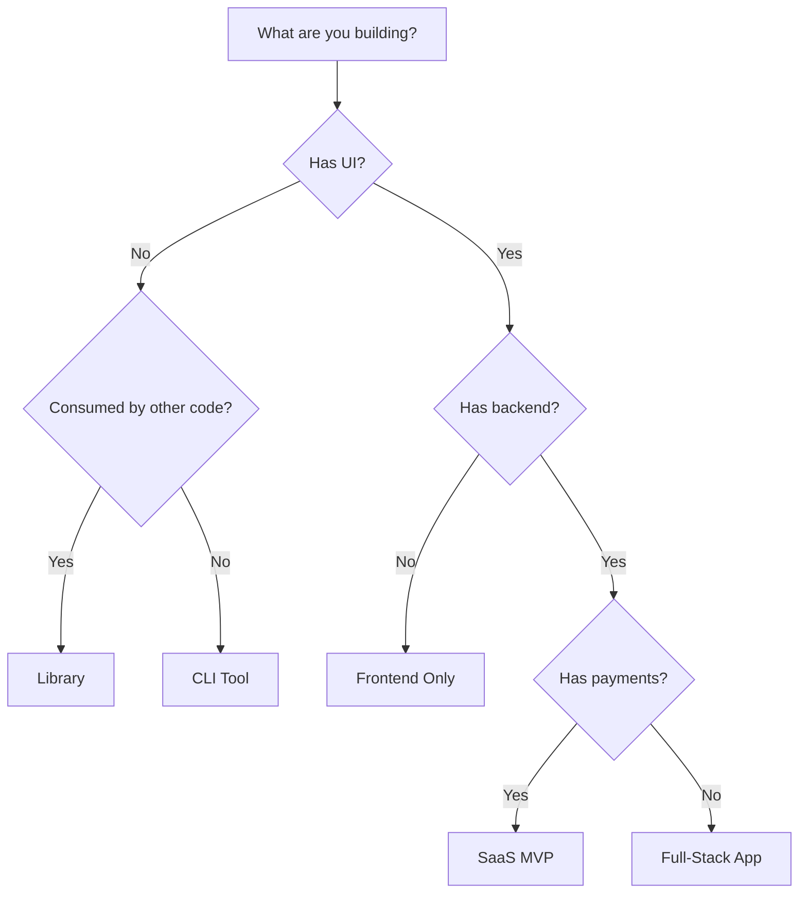

# Project Archetypes

Archetypes are pre-configured project templates that define the phases, workflows, quality gates, and autonomy rules for different types of applications.

## Available Archetypes

<CardGroup cols={2}>
  <Card title="SaaS MVP" icon="cloud">
    Multi-tenant SaaS with authentication, payments, and core features
  </Card>
  <Card title="API Service" icon="server">
    Backend API service consumed by other applications
  </Card>
  <Card title="CLI Tool" icon="terminal">
    Command-line utility for developers or operations
  </Card>
  <Card title="Library/SDK" icon="box">
    Reusable code package for other developers
  </Card>
  <Card title="Full-Stack App" icon="layers">
    Complete web application with frontend and backend
  </Card>
</CardGroup>

---

## SaaS MVP

**Best for**: Multi-tenant SaaS applications with user authentication, subscription billing, and core business features.

### Default Stack

| Layer | Technology |
|-------|------------|
| Frontend | Next.js |
| Backend | Next.js API Routes |
| Database | PostgreSQL |
| Auth | NextAuth.js |
| Payments | Stripe |
| Styling | Tailwind CSS |
| Components | shadcn/ui |
| Hosting | Vercel |

### Phases

1. **Discovery** - Requirements gathering
2. **Planning** - Architecture and design
3. **Foundation** - Project setup, auth system
4. **Core Features** - Main application features
5. **Payments** - Stripe integration (if applicable)
6. **Hardening** - Security and performance
7. **Deployment** - Production release

### Quality Gates

```yaml
after_feature:
  - npm run test
  - npm run lint
  - npm run typecheck

before_checkpoint:
  - npm run build
  - npm run test
  - npm run security:scan
```

### Autonomy Rules

| Pattern | Level | Reason |
|---------|-------|--------|
| `**/auth/**` | 3 | Authentication code |
| `**/payment*/**` | 3 | Payment code |
| `**/migrations/**` | 3 | Database changes |
| `.env*` | 4 | Secrets |

---

## API Service

**Best for**: Backend APIs consumed by web apps, mobile apps, or other services.

### Default Stack

| Layer | Technology |
|-------|------------|
| Backend | FastAPI |
| Database | PostgreSQL |
| Auth | JWT |
| Hosting | Railway |

### Phases

1. **Discovery** - Requirements gathering
2. **Planning** - API design, schema design
3. **Foundation** - Project setup, database
4. **Core** - API implementation
5. **Hardening** - Security, performance
6. **Deployment** - Production release

### Key Outputs

- OpenAPI specification
- Database schema
- API documentation

---

## CLI Tool

**Best for**: Command-line utilities for developers, DevOps, or automation.

### Default Stack

| Layer | Technology |
|-------|------------|
| Language | TypeScript |
| Runtime | Node.js |
| Package Manager | npm |

### Phases

1. **Discovery** - Command design
2. **Planning** - CLI structure
3. **Foundation** - Project scaffolding
4. **Core** - Command implementation
5. **Packaging** - npm package setup

### Key Features

- Command parsing
- Help text generation
- Configuration management
- Cross-platform support

---

## Library/SDK

**Best for**: Reusable packages published to npm for other developers.

### Default Stack

| Layer | Technology |
|-------|------------|
| Language | TypeScript |
| Build | tsup |
| Docs | TypeDoc |

### Phases

1. **Discovery** - API design
2. **Planning** - Public API specification
3. **Foundation** - Project setup
4. **Core** - Implementation
5. **Documentation** - API docs
6. **Packaging** - npm publish

### Quality Requirements

- **90%+ test coverage** (higher than other archetypes)
- Full TypeScript types
- Comprehensive documentation

---

## Full-Stack App

**Best for**: Complete web applications with both frontend and backend.

### Default Stack

| Layer | Technology |
|-------|------------|
| Frontend | Next.js |
| Backend | Next.js API Routes |
| Database | PostgreSQL |
| Styling | Tailwind CSS |
| Components | shadcn/ui |

### Phases

1. **Discovery** - Requirements gathering
2. **Planning** - Schema, wireframes
3. **Foundation** - Project setup
4. **Backend** - API implementation
5. **Frontend** - UI implementation
6. **Integration** - E2E testing
7. **Hardening** - Security, performance
8. **Deployment** - Production release

---

## Choosing an Archetype

### Decision Guide



### Quick Reference

| If you're building... | Use |
|----------------------|-----|
| SaaS with subscriptions | SaaS MVP |
| API for mobile app | API Service |
| Developer tool | CLI Tool |
| npm package | Library |
| Web app without payments | Full-Stack App |

---

## Customizing Archetypes

While archetypes provide sensible defaults, you can customize:

### During Discovery

The discovery interview asks about your preferences:

- "Which frontend framework do you prefer?"
- "What database do you want to use?"
- "What authentication approach?"

Your answers override archetype defaults.

### In State File

After initialization, you can modify `.omgkit/state.yaml`:

```yaml
project:
  archetype: saas-mvp

# Override specific settings
overrides:
  defaults:
    database: mongodb
    hosting: aws
```

### Creating Custom Archetypes

Place custom archetypes in:
```
plugin/templates/autonomous/archetypes/my-archetype.yaml
```

Follow the existing archetype structure.
