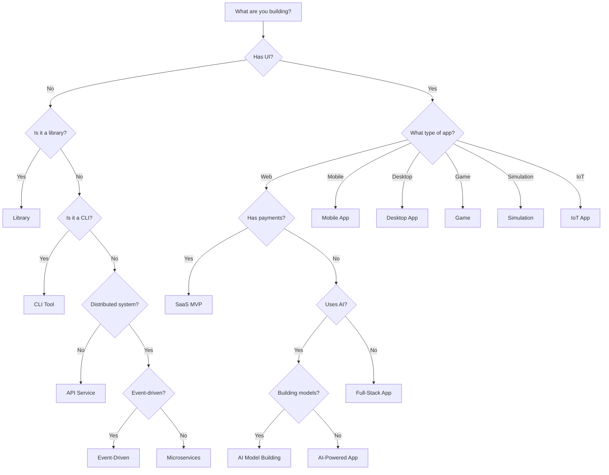

# Project Archetypes

Archetypes are pre-configured project templates that define the phases, workflows, quality gates, and autonomy rules for different types of applications.

## Available Archetypes

<CardGroup cols={3}>
  <Card title="SaaS MVP" icon="cloud">
    Multi-tenant SaaS with authentication, payments, and core features
  </Card>
  <Card title="API Service" icon="server">
    Backend API service consumed by other applications
  </Card>
  <Card title="CLI Tool" icon="terminal">
    Command-line utility for developers or operations
  </Card>
  <Card title="Library/SDK" icon="box">
    Reusable code package for other developers
  </Card>
  <Card title="Full-Stack App" icon="layers">
    Complete web application with frontend and backend
  </Card>
  <Card title="Mobile App" icon="mobile">
    iOS and Android applications with React Native or native development
  </Card>
  <Card title="AI-Powered App" icon="brain">
    LLM-based applications with RAG, function calling, and AI features
  </Card>
  <Card title="AI Model Building" icon="flask">
    Machine learning model development with training and deployment
  </Card>
  <Card title="Desktop App" icon="desktop">
    Cross-platform desktop applications with Electron or native frameworks
  </Card>
  <Card title="IoT App" icon="microchip">
    Internet of Things applications with device management and real-time data
  </Card>
  <Card title="Game" icon="gamepad">
    Game development with Unity, Godot, or web technologies
  </Card>
  <Card title="Simulation" icon="chart-line">
    Scientific or engineering simulations with numerical methods
  </Card>
  <Card title="Microservices" icon="cubes">
    Distributed systems with API gateway, service discovery, and Kubernetes
  </Card>
  <Card title="Event-Driven" icon="bolt">
    Asynchronous systems with message brokers, CQRS, and saga patterns
  </Card>
</CardGroup>

---

## SaaS MVP

**Best for**: Multi-tenant SaaS applications with user authentication, subscription billing, and core business features.

### Default Stack

| Layer | Technology |
|-------|------------|
| Frontend | Next.js |
| Backend | Next.js API Routes |
| Database | PostgreSQL |
| Auth | NextAuth.js |
| Payments | Stripe |
| Styling | Tailwind CSS |
| Components | shadcn/ui |
| Hosting | Vercel |

### Phases

1. **Discovery** - Requirements gathering
2. **Planning** - Architecture and design
3. **Foundation** - Project setup, auth system
4. **Core Features** - Main application features
5. **Payments** - Stripe integration (if applicable)
6. **Hardening** - Security and performance
7. **Deployment** - Production release

### Quality Gates

```yaml
after_feature:
  - npm run test
  - npm run lint
  - npm run typecheck

before_checkpoint:
  - npm run build
  - npm run test
  - npm run security:scan
```

### Autonomy Rules

| Pattern | Level | Reason |
|---------|-------|--------|
| `**/auth/**` | 3 | Authentication code |
| `**/payment*/**` | 3 | Payment code |
| `**/migrations/**` | 3 | Database changes |
| `.env*` | 4 | Secrets |

---

## API Service

**Best for**: Backend APIs consumed by web apps, mobile apps, or other services.

### Default Stack

| Layer | Technology |
|-------|------------|
| Backend | FastAPI |
| Database | PostgreSQL |
| Auth | JWT |
| Hosting | Railway |

### Phases

1. **Discovery** - Requirements gathering
2. **Planning** - API design, schema design
3. **Foundation** - Project setup, database
4. **Core** - API implementation
5. **Hardening** - Security, performance
6. **Deployment** - Production release

### Key Outputs

- OpenAPI specification
- Database schema
- API documentation

---

## CLI Tool

**Best for**: Command-line utilities for developers, DevOps, or automation.

### Default Stack

| Layer | Technology |
|-------|------------|
| Language | TypeScript |
| Runtime | Node.js |
| Package Manager | npm |

### Phases

1. **Discovery** - Command design
2. **Planning** - CLI structure
3. **Foundation** - Project scaffolding
4. **Core** - Command implementation
5. **Packaging** - npm package setup

### Key Features

- Command parsing
- Help text generation
- Configuration management
- Cross-platform support

---

## Library/SDK

**Best for**: Reusable packages published to npm for other developers.

### Default Stack

| Layer | Technology |
|-------|------------|
| Language | TypeScript |
| Build | tsup |
| Docs | TypeDoc |

### Phases

1. **Discovery** - API design
2. **Planning** - Public API specification
3. **Foundation** - Project setup
4. **Core** - Implementation
5. **Documentation** - API docs
6. **Packaging** - npm publish

### Quality Requirements

- **90%+ test coverage** (higher than other archetypes)
- Full TypeScript types
- Comprehensive documentation

---

## Full-Stack App

**Best for**: Complete web applications with both frontend and backend.

### Default Stack

| Layer | Technology |
|-------|------------|
| Frontend | Next.js |
| Backend | Next.js API Routes |
| Database | PostgreSQL |
| Styling | Tailwind CSS |
| Components | shadcn/ui |

### Phases

1. **Discovery** - Requirements gathering
2. **Planning** - Schema, wireframes
3. **Foundation** - Project setup
4. **Backend** - API implementation
5. **Frontend** - UI implementation
6. **Integration** - E2E testing
7. **Hardening** - Security, performance
8. **Deployment** - Production release

---

## Mobile App

**Best for**: iOS and Android applications, either cross-platform or native.

### Default Stack

| Layer | Technology |
|-------|------------|
| Framework | React Native (Expo) |
| State | Zustand |
| Navigation | React Navigation |
| Backend | Supabase |
| Analytics | Mixpanel |

### Phases

1. **Discovery** - Requirements and platform strategy
2. **Design** - UI/UX design and prototyping
3. **Foundation** - Project setup, navigation structure
4. **Core Features** - Main app functionality
5. **Native Features** - Platform-specific integrations
6. **Testing** - Device testing and optimization
7. **Deployment** - App store submission

### Discovery Questions

- Target platforms (iOS, Android, both)?
- Native features needed (camera, location, push)?
- Offline support required?
- App store requirements?

### Autonomy Rules

| Pattern | Level | Reason |
|---------|-------|--------|
| `**/auth/**` | 3 | Authentication code |
| `**/native/**` | 2 | Native integrations |
| `app.json` | 3 | App configuration |
| `**/store-assets/**` | 4 | App store assets |

---

## AI-Powered App

**Best for**: LLM-based applications with RAG, function calling, multi-model architectures, and AI features.

### Default Stack

| Layer | Technology |
|-------|------------|
| AI Provider | Anthropic Claude |
| Framework | Next.js |
| Vector DB | Pinecone |
| Orchestration | LangChain |
| Embedding | OpenAI |
| Caching | Redis |

### Phases

1. **Discovery** - AI requirements and use cases
2. **Planning** - Architecture and model selection
3. **Foundation** - Project setup, AI integrations
4. **Core Features** - Main AI functionality
5. **Advanced Features** - RAG, function calling, agents
6. **Optimization** - Cost, latency, quality tuning
7. **Safety** - Guardrails, content filtering
8. **Deployment** - Production with monitoring

### Discovery Questions

- What AI capabilities are needed?
- Single model or multi-model?
- RAG required? What data sources?
- Function calling / tool use?
- Cost budget and latency requirements?

### Autonomy Rules

| Pattern | Level | Reason |
|---------|-------|--------|
| `**/prompts/**` | 2 | Prompt engineering |
| `**/guardrails/**` | 3 | Safety critical |
| `**/agents/**` | 3 | Agent behavior |
| `**/models/**` | 2 | Model configuration |

---

## AI Model Building

**Best for**: Machine learning model development, training pipelines, and ML deployment.

### Default Stack

| Layer | Technology |
|-------|------------|
| Framework | PyTorch |
| Experiment Tracking | Weights & Biases |
| Data Versioning | DVC |
| Model Registry | MLflow |
| Compute | Cloud GPU |

### Phases

1. **Discovery** - Problem definition and metrics
2. **Data Engineering** - Data collection and processing
3. **Exploration** - EDA and baseline models
4. **Model Development** - Architecture design
5. **Training** - Training pipeline and experiments
6. **Evaluation** - Testing and validation
7. **Deployment** - Model serving
8. **Monitoring** - Drift detection and retraining

### Discovery Questions

- Supervised, unsupervised, or reinforcement learning?
- What evaluation metrics matter?
- Dataset size and type?
- Inference latency requirements?
- On-device or cloud serving?

### Autonomy Rules

| Pattern | Level | Reason |
|---------|-------|--------|
| `**/data/**` | 2 | Data processing |
| `**/models/**` | 3 | Model architecture |
| `**/training/**` | 2 | Training config |
| `**/deploy/**` | 3 | Deployment critical |

---

## Desktop App

**Best for**: Cross-platform desktop applications for Windows, macOS, and Linux.

### Default Stack

| Layer | Technology |
|-------|------------|
| Framework | Electron |
| UI | React |
| Packaging | electron-builder |
| Updates | electron-updater |
| Storage | electron-store |

### Phases

1. **Discovery** - Requirements and platform targets
2. **Planning** - Architecture and UX design
3. **Foundation** - Project setup, window management
4. **Core Features** - Main application features
5. **Native Integration** - System tray, file system, IPC
6. **Packaging** - Installers and code signing
7. **Distribution** - Auto-updates and release

### Discovery Questions

- Target platforms (Windows, Mac, Linux)?
- Native OS integrations needed?
- Auto-update requirements?
- Code signing and notarization?

### Autonomy Rules

| Pattern | Level | Reason |
|---------|-------|--------|
| `**/main/**` | 3 | Main process |
| `**/native/**` | 3 | Native integrations |
| `electron-builder.*` | 3 | Build config |
| `**/signing/**` | 4 | Code signing |

---

## IoT App

**Best for**: Internet of Things applications with device management, real-time data, and edge computing.

### Default Stack

| Layer | Technology |
|-------|------------|
| Protocol | MQTT |
| Broker | Mosquitto |
| Time-Series DB | TimescaleDB |
| Cloud | AWS IoT |
| Dashboard | Grafana |

### Phases

1. **Discovery** - Device and data requirements
2. **Planning** - Architecture and protocols
3. **Foundation** - Cloud infrastructure setup
4. **Backend** - Device registry and messaging
5. **Dashboard** - Monitoring and control UI
6. **Edge Computing** - Device-side processing
7. **Security** - Device authentication and encryption
8. **Scaling** - Fleet management and optimization

### Discovery Questions

- What devices and sensors?
- Communication protocols needed?
- Real-time vs batch processing?
- Edge computing requirements?
- Fleet size and scaling needs?

### Autonomy Rules

| Pattern | Level | Reason |
|---------|-------|--------|
| `**/firmware/**` | 4 | Device firmware |
| `**/security/**` | 3 | Security critical |
| `**/protocols/**` | 3 | Communication |
| `**/edge/**` | 2 | Edge processing |

---

## Game

**Best for**: Game development with Unity, Godot, or web-based game engines.

### Default Stack

| Layer | Technology |
|-------|------------|
| Engine | Unity |
| Language | C# |
| Art | Blender |
| Audio | FMOD |
| Build | Unity Cloud Build |

### Phases

1. **Discovery** - Game concept and scope
2. **Design** - GDD and mechanics design
3. **Foundation** - Project setup, core systems
4. **Core Gameplay** - Game loop and mechanics
5. **Content** - Levels, assets, audio
6. **Polish** - VFX, juice, optimization
7. **Multiplayer** - Networking (if applicable)
8. **Release** - Platform submission

### Discovery Questions

- What genre and platform?
- Single-player or multiplayer?
- 2D or 3D?
- Monetization model?
- Target performance specs?

### Autonomy Rules

| Pattern | Level | Reason |
|---------|-------|--------|
| `**/Core/**` | 3 | Core game systems |
| `**/Multiplayer/**` | 3 | Networking code |
| `**/Editor/**` | 2 | Editor tools |
| `**/Content/**` | 1 | Game content |

---

## Simulation

**Best for**: Scientific or engineering simulations with numerical methods, visualization, and validation.

### Default Stack

| Layer | Technology |
|-------|------------|
| Language | Python |
| Compute | NumPy/SciPy |
| Visualization | Matplotlib/Plotly |
| Parallel | Multiprocessing |
| Documentation | Sphinx |

### Phases

1. **Discovery** - Problem definition and accuracy requirements
2. **Modeling** - Mathematical model development
3. **Foundation** - Solver framework setup
4. **Core Simulation** - Physics engine implementation
5. **Visualization** - 2D/3D rendering
6. **Optimization** - Performance and parallelization
7. **Validation** - Verification against benchmarks
8. **Distribution** - Packaging and documentation

### Discovery Questions

- What physical phenomena?
- Continuous or discrete simulation?
- Required numerical precision?
- Real-time requirements?
- Visualization needs?

### Autonomy Rules

| Pattern | Level | Reason |
|---------|-------|--------|
| `**/solvers/**` | 3 | Numerical methods |
| `**/physics/**` | 3 | Physics critical |
| `**/visualization/**` | 1 | Lower risk |
| `configs/**` | 2 | Affects results |

---

## Microservices

**Best for**: Distributed systems with independently deployable services, API gateway, and container orchestration.

### Default Stack

| Layer | Technology |
|-------|------------|
| Language | TypeScript/Node.js |
| Framework | NestJS |
| API Gateway | Kong |
| Service Discovery | Kubernetes DNS |
| Containers | Docker |
| Orchestration | Kubernetes |
| Tracing | Jaeger |
| Metrics | Prometheus |

### Phases

1. **Discovery** - Domain analysis, bounded contexts, service boundaries
2. **Architecture** - Service contracts, gateway design, communication patterns
3. **Foundation** - Docker, Kubernetes manifests, shared libraries
4. **Core Services** - Per-service implementation
5. **Integration** - Inter-service communication, tracing, circuit breakers
6. **Testing** - Integration tests, contract tests, load tests
7. **DevOps** - CI/CD pipelines, monitoring, deployment

### Discovery Questions

- What are the main business domains/capabilities?
- How many services do you envision?
- Synchronous or asynchronous communication?
- Existing Kubernetes cluster?
- Team structure (aligned with services)?

### Autonomy Rules

| Pattern | Level | Reason |
|---------|-------|--------|
| `**/gateway/**` | 3 | API Gateway critical |
| `**/k8s/**` | 3 | Infrastructure |
| `**/shared/**` | 3 | Affects all services |
| `**/services/*/src/**` | 2 | Service code |
| `Dockerfile*` | 2 | Container config |

---

## Event-Driven

**Best for**: Asynchronous systems with message brokers, event sourcing, CQRS, and saga patterns.

### Default Stack

| Layer | Technology |
|-------|------------|
| Message Broker | Apache Kafka |
| Language | TypeScript/Node.js |
| Framework | NestJS |
| Event Store | Kafka |
| Read Database | PostgreSQL |
| Schema Registry | Confluent |
| Streaming | Kafka Streams |

### Phases

1. **Discovery** - Event storming, domain events, aggregate design
2. **Architecture** - Topic design, schemas, CQRS strategy, saga patterns
3. **Foundation** - Broker setup, schema registry, DLQ
4. **Producers** - Command handlers, event publishing, outbox pattern
5. **Consumers** - Event handlers, projections, saga orchestrators
6. **CQRS** - Read models, query APIs, eventual consistency
7. **Monitoring** - Event flow tests, consumer lag, observability

### Discovery Questions

- What are the main domain events?
- Event sourcing needed or just messaging?
- CQRS required (separate read/write models)?
- Ordering requirements?
- Exactly-once or at-least-once semantics?

### Autonomy Rules

| Pattern | Level | Reason |
|---------|-------|--------|
| `**/events/**` | 3 | Event schemas are contracts |
| `**/schemas/**` | 3 | Affects all consumers |
| `**/sagas/**` | 3 | Transaction-critical |
| `**/projections/**` | 2 | Read model changes |
| `**/consumers/**` | 2 | Consumer configuration |

---

## Choosing an Archetype

### Decision Guide



### Quick Reference

| If you're building... | Use |
|----------------------|-----|
| SaaS with subscriptions | SaaS MVP |
| API for other apps | API Service |
| Developer tool | CLI Tool |
| npm package | Library |
| Web app without payments | Full-Stack App |
| iOS/Android app | Mobile App |
| LLM/RAG application | AI-Powered App |
| ML models and training | AI Model Building |
| Windows/Mac/Linux app | Desktop App |
| IoT/sensor system | IoT App |
| Video game | Game |
| Scientific simulation | Simulation |
| Distributed services with K8s | Microservices |
| Async system with message broker | Event-Driven |

---

## Customizing Archetypes

While archetypes provide sensible defaults, you can customize:

### During Discovery

The discovery interview asks about your preferences:

- "Which frontend framework do you prefer?"
- "What database do you want to use?"
- "What authentication approach?"

Your answers override archetype defaults.

### In State File

After initialization, you can modify `.omgkit/state.yaml`:

```yaml
project:
  archetype: saas-mvp

# Override specific settings
overrides:
  defaults:
    database: mongodb
    hosting: aws
```

### Creating Custom Archetypes

Place custom archetypes in:
```
plugin/templates/autonomous/archetypes/my-archetype.yaml
```

Follow the existing archetype structure.
