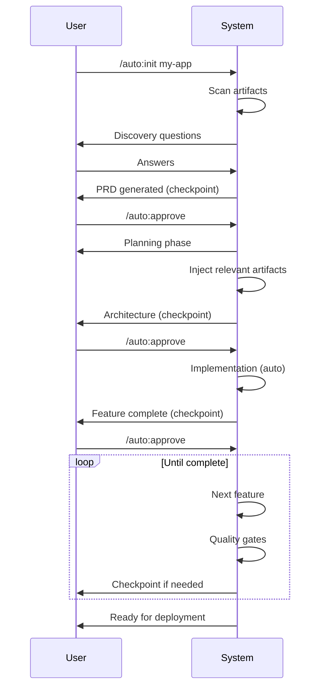

# Autonomous Commands

These commands control the autonomous development system, from project initialization through deployment. The system supports [12 project archetypes](/autonomous/archetypes) and leverages the [artifacts system](/autonomous/overview#artifacts-system) for enhanced context.

## Command Overview

| Command | Description |
|---------|-------------|
| `/auto:init` | Start discovery for new project |
| `/auto:start` | Begin/continue autonomous execution |
| `/auto:status` | Check project progress |
| `/auto:next` | Preview next action |
| `/auto:approve` | Approve checkpoint to continue |
| `/auto:reject` | Request changes with feedback |
| `/auto:verify` | Run verification checks |
| `/auto:checkpoint` | Force a review point |
| `/auto:resume` | Resume from saved state |

---

## /auto:init

**Start discovery for a new project**

```bash
/auto:init <project idea or name>
```

### What It Does

1. Starts a structured discovery interview across 5 stages
2. Asks questions adapted to your project type
3. Generates comprehensive PRD (Product Requirements Document)
4. Creates technical specification
5. Recommends appropriate [archetype](/autonomous/archetypes)
6. Scans for existing [artifacts](/autonomous/overview#artifacts-system)
7. Initializes project state

### Discovery Stages

| Stage | Focus |
|-------|-------|
| **Vision** | Problem, solution, business model, timeline |
| **Users** | Primary users, personas, scale |
| **Features** | Core features, scope, success metrics |
| **Technical** | Stack preferences, integrations |
| **Risks** | Technical and business risks, MVP definition |

### Archetype Selection

Based on your answers, the system recommends one of 12 archetypes:

| Project Type | Recommended Archetype |
|--------------|----------------------|
| Multi-tenant SaaS | [SaaS MVP](/autonomous/archetypes#saas-mvp) |
| Backend API | [API Service](/autonomous/archetypes#api-service) |
| Command-line tool | [CLI Tool](/autonomous/archetypes#cli-tool) |
| npm package | [Library/SDK](/autonomous/archetypes#librarysdk) |
| Web application | [Full-Stack App](/autonomous/archetypes#full-stack-app) |
| iOS/Android app | [Mobile App](/autonomous/archetypes#mobile-app) |
| LLM/AI application | [AI-Powered App](/autonomous/archetypes#ai-powered-app) |
| ML model training | [AI Model Building](/autonomous/archetypes#ai-model-building) |
| Desktop application | [Desktop App](/autonomous/archetypes#desktop-app) |
| IoT system | [IoT App](/autonomous/archetypes#iot-app) |
| Video game | [Game](/autonomous/archetypes#game) |
| Scientific simulation | [Simulation](/autonomous/archetypes#simulation) |

### Examples

```bash
# SaaS application
/auto:init freelancer invoicing app

# Mobile app
/auto:init fitness tracking mobile app

# AI-powered application
/auto:init customer support chatbot with RAG

# Desktop application
/auto:init markdown editor for mac and windows

# Game
/auto:init 2D puzzle platformer game
```

### Output Files

| File | Description |
|------|-------------|
| `.omgkit/generated/prd.md` | Product Requirements Document |
| `.omgkit/generated/technical-spec.md` | Technical Specification |
| `.omgkit/generated/discovery-answers.yaml` | Raw discovery answers |
| `.omgkit/state.yaml` | Project state |

### Artifacts Detection

During init, the system scans for existing artifacts:

```
.omgkit/artifacts/
├── data/       # Sample data, schemas
├── docs/       # Requirements, user stories
├── knowledge/  # Glossary, business rules
├── research/   # Competitor analysis
├── assets/     # Images, templates
└── examples/   # Code samples
```

If you have existing requirements documents, sample data, or reference implementations, place them in the artifacts folder before running `/auto:init`.

---

## /auto:start

**Begin or continue autonomous execution**

```bash
/auto:start [--from-phase <phase>]
```

### Options

| Option | Description |
|--------|-------------|
| `--from-phase` | Start from a specific phase |

### What It Does

1. Loads current project state from `.omgkit/state.yaml`
2. Loads archetype definition with phases and workflows
3. Injects relevant [artifacts](/autonomous/overview#artifacts-system) into context
4. Determines current phase and next steps
5. Executes phase workflows with quality gates
6. Creates checkpoints at phase boundaries
7. Updates state and memory

### Phase Execution

Each archetype defines phases. For example, [SaaS MVP](/autonomous/archetypes#saas-mvp):

1. Discovery → Planning → Foundation → Core Features → Payments → Hardening → Deployment

The system executes each phase's:
- **Workflows** - Orchestrated development processes
- **Features** - Per-feature implementation with tests
- **Steps** - Individual tasks within features
- **Quality Gates** - Automated checks after each feature

### Autonomy Levels

The system respects [autonomy levels](/autonomous/overview#autonomy-levels):

| Level | Behavior |
|-------|----------|
| 0 | Auto-execute without notification |
| 1 | Execute and notify (default) |
| 2 | Preview, quick approve |
| 3 | Full review required |
| 4 | Human must do it |

High-risk patterns (auth, payments, migrations) automatically use Level 3.

### Example

```bash
# Continue from current state
/auto:start

# Start from foundation phase
/auto:start --from-phase foundation

# For AI projects, start from data engineering
/auto:start --from-phase data_engineering
```

---

## /auto:status

**Show project progress and status**

```bash
/auto:status [--verbose]
```

### Options

| Option | Description |
|--------|-------------|
| `--verbose` | Show detailed logs, memory state, and metrics |

### Output

```
## Project Status: My SaaS App

**Type:** saas | **Archetype:** saas-mvp
**Status:** 🔄 In Progress
**Started:** 2024-01-15 | **Last Activity:** 10 min ago

### Overall Progress
[████████░░░░░░░░░░░░] 42%

### Phase Progress
| Phase | Status | Progress |
|-------|--------|----------|
| ✅ Discovery | Complete | 100% |
| ✅ Planning | Complete | 100% |
| 🔄 Foundation | In Progress | 60% |
| ⏳ Core Features | Pending | 0% |

### Active Artifacts
| Artifact | Type | Injected |
|----------|------|----------|
| requirements.md | requirements | ✅ |
| glossary.md | domain_glossary | ✅ |
| sample-data.json | sample_data | ✅ |

### Quality Gates
| Gate | Status | Last Run |
|------|--------|----------|
| Tests | ✅ Pass | 2 min ago |
| Build | ✅ Pass | 5 min ago |
| Coverage | ⚠️ 76% | 2 min ago |
```

### Status Codes

| Status | Icon | Meaning |
|--------|------|---------|
| `ready` | 🟢 | Ready to start/continue |
| `in_progress` | 🔄 | Currently executing |
| `checkpoint` | ⏸️ | Paused for approval |
| `blocked` | 🔴 | Error or issue |
| `completed` | ✅ | All phases done |
| `revision_needed` | 🔁 | Changes requested |

---

## /auto:next

**Preview or execute the next action**

```bash
/auto:next [--preview | --execute | --skip]
```

### Options

| Option | Description |
|--------|-------------|
| `--preview` | Show what will happen (default) |
| `--execute` | Execute the next action |
| `--skip` | Skip the next action |

### Preview Output

```
## Next Action Preview

### Action: Implement Password Hashing

**Type:** Implementation
**Phase:** Foundation > User Authentication
**Step:** 3 of 7
**Autonomy Level:** 1 (Notify)

### What Will Be Done

1. Create `src/utils/password.ts`
2. Modify `src/services/user.service.ts`
3. Create tests in `src/utils/password.test.ts`

### Artifacts Being Used
- `requirements.md` - Security requirements section
- `business-rules.md` - Password policy

### After This
- Password reset implementation
- Session management
```

---

## /auto:approve

**Approve checkpoint or decision**

```bash
/auto:approve [checkpoint | decision <id>] [--all]
```

### Usage

```bash
# Approve current checkpoint
/auto:approve

# Approve specific decision
/auto:approve decision db_index_strategy

# Approve all pending items
/auto:approve --all
```

### What It Does

1. Validates artifacts are ready
2. Records approval in memory
3. Updates state to continue
4. Logs decision for audit trail

### Checkpoint Types

| Type | Trigger |
|------|---------|
| `phase` | Phase completion |
| `quality_gate` | Failed quality check |
| `decision` | Requires user input |
| `manual` | User-requested pause |

---

## /auto:reject

**Reject with feedback for revision**

```bash
/auto:reject <reason> [--checkpoint | --decision <id>] [--category <type>]
```

### Options

| Option | Description |
|--------|-------------|
| `--checkpoint` | Reject current checkpoint |
| `--decision` | Reject specific decision |
| `--category` | Categorize: `scope_change`, `quality_issue`, `design_issue`, `missing_item`, `other` |

### Examples

```bash
# Reject with feedback
/auto:reject "The schema needs a soft delete column for users"

# Categorized rejection
/auto:reject "Need to add mobile support" --category scope_change

# Reject specific decision
/auto:reject "Prefer MongoDB over PostgreSQL" --decision db_choice
```

### What Happens

1. Captures your feedback
2. Categorizes the rejection
3. Analyzes impact on project
4. Generates revision plan
5. Records rejection for learning
6. Updates state to `revision_needed`

---

## /auto:verify

**Run verification checks**

```bash
/auto:verify [--full | --quick | --phase <phase>]
```

### Options

| Option | Description |
|--------|-------------|
| `--full` | Run all verification checks |
| `--quick` | Run essential checks only |
| `--phase` | Verify specific phase |

### Verification Categories

| Category | Checks |
|----------|--------|
| **State Integrity** | Valid YAML, consistent data |
| **Artifacts** | Expected files exist, checksums match |
| **Code Quality** | Tests pass, lint clean, types valid |
| **Consistency** | PRD matches implementation |
| **Memory** | Context files current |

### Output

```
## Verification Complete ✓

| Category | Status | Checks |
|----------|--------|--------|
| State Integrity | ✅ Pass | 5/5 |
| Artifacts | ✅ Pass | 8/8 |
| Code Quality | ⚠️ Fail | 3/4 |
| Consistency | ✅ Pass | 6/6 |
| Memory | ✅ Pass | 3/3 |

### Issues Found

1. **Code Quality: Coverage below threshold**
   - Current: 72%
   - Required: 80%
   - Suggestion: Add tests for UserService
```

---

## /auto:checkpoint

**Force a manual checkpoint**

```bash
/auto:checkpoint [<reason>]
```

### When to Use

- Before a critical section
- To review progress
- Before taking a break
- To discuss approach with team
- Before making irreversible changes

### Example

```bash
/auto:checkpoint "Want to review before implementing payments"
```

### Output

```
## Manual Checkpoint Created

**Reason:** Want to review before implementing payments

### Current State
- **Phase:** Core Features
- **Feature:** Payment Integration
- **Step:** 0 of 5 (not started)

### Files to Review
- `src/services/payment.service.ts` (planned)
- `src/routes/payment.routes.ts` (planned)

### Resume Options
- `/auto:approve` - Continue with payments
- `/auto:reject` - Provide feedback first
- `/auto:start --from-phase hardening` - Skip to hardening
```

---

## /auto:resume

**Resume from saved state**

```bash
/auto:resume [--retry | --skip | --from <step>]
```

### Options

| Option | Description |
|--------|-------------|
| `--retry` | Retry the last failed action |
| `--skip` | Skip problematic step |
| `--from` | Resume from specific step |

### Recovery Scenarios

**After Error:**
```bash
# Fix the issue manually, then:
/auto:resume --retry
```

**Skip Problematic Step:**
```bash
# If a step can't be completed:
/auto:resume --skip
```

**Go Back:**
```bash
# Resume from a specific step:
/auto:resume --from user_authentication
```

### Resume Context

The system saves detailed state for reliable resume:

```yaml
resume_point:
  phase: "core_features"
  feature: "user_authentication"
  step: "implement_login"
  attempt: 2
  error_context:
    message: "Test timeout"
    file: "user.service.test.ts"
```

---

## Command Flow



---

## Tips

1. **Add artifacts before `/auto:init`** - Requirements, sample data, and domain knowledge improve results
2. **Use `/auto:status` frequently** - Track progress and catch issues early
3. **Review checkpoints carefully** - These are your control points
4. **Provide detailed feedback** with `/auto:reject` - Help the system learn what you want
5. **Use `/auto:next --preview`** - Understand what's coming before it executes
6. **Force checkpoints** with `/auto:checkpoint` when you need to pause

---

## Related Pages

- [Autonomous Overview](/autonomous/overview) - How the system works
- [Project Archetypes](/autonomous/archetypes) - All 12 project templates
- [Artifacts System](/autonomous/overview#artifacts-system) - Providing project context
