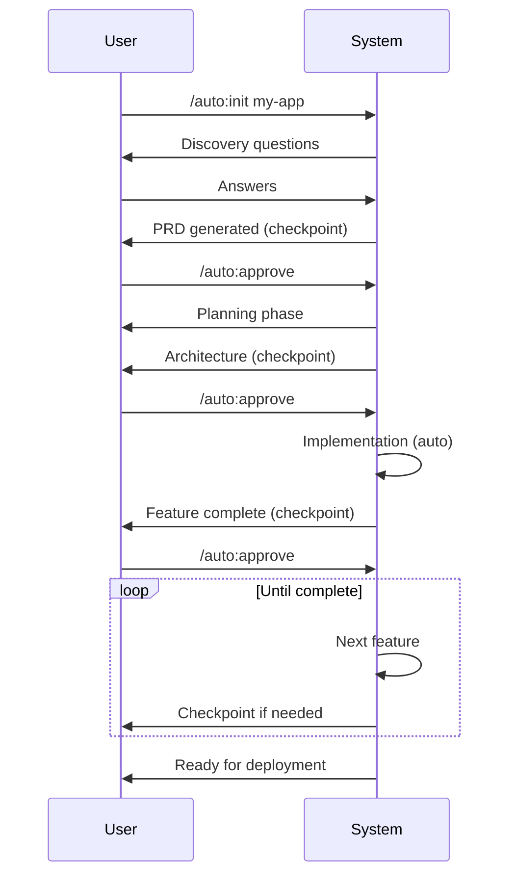

# Autonomous Commands

These commands control the autonomous development system, from project initialization through deployment.

## /auto:init

**Start discovery for a new project**

```bash
/auto:init <project idea or name>
```

### What It Does

1. Starts a structured discovery interview
2. Asks questions across 5 stages (Vision, Users, Features, Technical, Risks)
3. Generates comprehensive PRD
4. Creates technical specification
5. Recommends appropriate archetype
6. Initializes project state

### Example

```bash
/auto:init freelancer invoicing app
```

The system will then ask questions like:

- "What problem is this solving?"
- "Who is the primary user?"
- "What are the core features?"
- "What tech stack do you prefer?"

### Output Files

- `.omgkit/generated/prd.md` - Product Requirements Document
- `.omgkit/generated/technical-spec.md` - Technical Specification
- `.omgkit/generated/discovery-answers.yaml` - Raw answers
- `.omgkit/state.yaml` - Project state

---

## /auto:start

**Begin or continue autonomous execution**

```bash
/auto:start [--from-phase <phase>]
```

### Options

| Option | Description |
|--------|-------------|
| `--from-phase` | Start from specific phase |

### What It Does

1. Loads current project state
2. Determines current phase and step
3. Executes phase workflows
4. Runs quality gates
5. Creates checkpoints at phase boundaries

### Example

```bash
# Continue from where we left off
/auto:start

# Start from a specific phase
/auto:start --from-phase foundation
```

---

## /auto:status

**Show project progress and status**

```bash
/auto:status [--verbose]
```

### Options

| Option | Description |
|--------|-------------|
| `--verbose` | Show detailed logs and metrics |

### Output

```
## Project Status: My SaaS App

**Type:** saas | **Archetype:** saas-mvp
**Status:** 🔄 In Progress
**Started:** 2024-01-15 | **Last Activity:** 10 min ago

### Overall Progress
[████████░░░░░░░░░░░░] 42%

### Phase Progress
| Phase | Status | Progress |
|-------|--------|----------|
| ✅ Discovery | Complete | 100% |
| ✅ Planning | Complete | 100% |
| 🔄 Foundation | In Progress | 60% |
| ⏳ Backend | Pending | 0% |
```

---

## /auto:next

**Preview or execute the next action**

```bash
/auto:next [--preview | --execute | --skip]
```

### Options

| Option | Description |
|--------|-------------|
| `--preview` | Show what will happen (default) |
| `--execute` | Execute the next action |
| `--skip` | Skip the next action |

### Example Output

```
## Next Action Preview

### Action: Implement Password Hashing

**Type:** Implementation
**Phase:** Backend > User Authentication
**Step:** 3 of 7

### What Will Be Done

1. Create `src/utils/password.ts`
2. Modify `src/services/user.service.ts`
3. Create tests in `src/utils/password.test.ts`
```

---

## /auto:approve

**Approve checkpoint or decision**

```bash
/auto:approve [checkpoint | decision <id>] [--all]
```

### Usage

```bash
# Approve current checkpoint
/auto:approve

# Approve specific decision
/auto:approve decision db_index_strategy

# Approve all pending items
/auto:approve --all
```

### What It Does

1. Validates artifacts are ready
2. Records approval in memory
3. Updates state to continue
4. Logs decision for audit

---

## /auto:reject

**Reject with feedback for revision**

```bash
/auto:reject <reason> [--checkpoint | --decision <id>]
```

### Example

```bash
/auto:reject "The schema needs a soft delete column for users"
```

### What Happens

1. Captures your feedback
2. Analyzes impact on project
3. Generates revision plan
4. Records rejection for learning

---

## /auto:verify

**Run verification checks**

```bash
/auto:verify [--full | --quick | --phase <phase>]
```

### Verification Categories

1. **State Integrity** - Valid YAML, consistent data
2. **Artifacts** - Expected files exist
3. **Code Quality** - Tests, lint, types
4. **Consistency** - PRD matches implementation
5. **Memory** - Context files current

### Example Output

```
## Verification Complete ✓

| Category | Status | Checks |
|----------|--------|--------|
| State Integrity | ✅ Pass | 5/5 |
| Artifacts | ✅ Pass | 8/8 |
| Code Quality | ⚠️ Fail | 3/4 |
```

---

## /auto:checkpoint

**Force a manual checkpoint**

```bash
/auto:checkpoint [<reason>]
```

### When to Use

- Before a critical section
- To review progress
- Before taking a break
- To discuss approach

### Example

```bash
/auto:checkpoint "Want to review before implementing payments"
```

---

## /auto:resume

**Resume from saved state**

```bash
/auto:resume [--retry | --skip | --from <step>]
```

### Options

| Option | Description |
|--------|-------------|
| `--retry` | Retry the last failed action |
| `--skip` | Skip problematic step |
| `--from` | Resume from specific step |

### Recovery Modes

**After Error**:
```bash
# Fix the issue, then:
/auto:resume --retry
```

**Skip Problematic Step**:
```bash
/auto:resume --skip
```

**Go Back**:
```bash
/auto:resume --from user_authentication
```

---

## Command Flow



---

## Tips

1. **Use `/auto:status` frequently** to track progress
2. **Review checkpoints carefully** - they're your control points
3. **Provide detailed feedback** with `/auto:reject` to guide revisions
4. **Use `/auto:next --preview`** to understand what's coming
5. **Force checkpoints** with `/auto:checkpoint` when you need to pause
