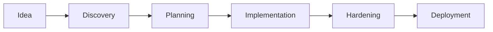

# Autonomous Development System

OMGKIT's autonomous development system transforms a project idea into a complete, working application through AI-driven development with strategic human checkpoints.

## How It Works



### 1. Discovery Phase

Start with `/auto:init your-project-idea` to begin a structured discovery interview:

- **Vision & Strategy** - What problem are you solving? Why now?
- **Users & Personas** - Who will use this? What do they need?
- **Features & Scope** - What should it do? What's out of scope?
- **Technical Context** - What stack? What integrations?
- **Risk Assessment** - What could go wrong? How to mitigate?

**Output**: A comprehensive PRD (Product Requirements Document)

### 2. Planning Phase

The system designs your architecture:

- Database schema design
- API specification
- Component structure
- Feature breakdown with implementation order

**Checkpoint**: Review designs before implementation begins

### 3. Implementation Phase

Features are built one by one with:

- Automated code generation
- Test writing
- Code review
- Quality gates after each feature

### 4. Hardening Phase

Before deployment:

- Security audit
- Performance optimization
- Error handling
- Monitoring setup

### 5. Deployment Phase

- Environment configuration
- CI/CD pipeline setup
- Staging deployment
- Production release

## Commands

| Command | Description |
|---------|-------------|
| `/auto:init` | Start discovery for new project |
| `/auto:start` | Begin/continue autonomous execution |
| `/auto:status` | Check project progress |
| `/auto:next` | Preview next action |
| `/auto:approve` | Approve checkpoint to continue |
| `/auto:reject` | Request changes with feedback |
| `/auto:verify` | Run verification checks |
| `/auto:checkpoint` | Force a review point |
| `/auto:resume` | Resume from saved state |

## Project Archetypes

Choose the right archetype for your project:

<CardGroup cols={3}>
  <Card title="SaaS MVP" icon="cloud" href="/autonomous/archetypes#saas-mvp">
    Multi-tenant SaaS with auth, payments, and core features
  </Card>
  <Card title="API Service" icon="server" href="/autonomous/archetypes#api-service">
    Backend API consumed by other applications
  </Card>
  <Card title="CLI Tool" icon="terminal" href="/autonomous/archetypes#cli-tool">
    Command-line utility for developers
  </Card>
  <Card title="Library" icon="box" href="/autonomous/archetypes#librarysdk">
    Reusable package for other developers
  </Card>
  <Card title="Full-Stack App" icon="layers" href="/autonomous/archetypes#full-stack-app">
    Complete web application with frontend and backend
  </Card>
  <Card title="Mobile App" icon="mobile" href="/autonomous/archetypes#mobile-app">
    iOS and Android applications
  </Card>
  <Card title="AI-Powered App" icon="brain" href="/autonomous/archetypes#ai-powered-app">
    LLM-based apps with RAG and AI features
  </Card>
  <Card title="AI Model Building" icon="flask" href="/autonomous/archetypes#ai-model-building">
    ML model development and training
  </Card>
  <Card title="Desktop App" icon="desktop" href="/autonomous/archetypes#desktop-app">
    Cross-platform desktop applications
  </Card>
  <Card title="IoT App" icon="microchip" href="/autonomous/archetypes#iot-app">
    Device management and real-time data
  </Card>
  <Card title="Game" icon="gamepad" href="/autonomous/archetypes#game">
    Game development with Unity or Godot
  </Card>
  <Card title="Simulation" icon="chart-line" href="/autonomous/archetypes#simulation">
    Scientific and engineering simulations
  </Card>
</CardGroup>

## Artifacts System

The autonomous system can leverage project artifacts to better understand context and requirements. Artifacts are automatically detected and injected into the development process.

### Artifact Categories

| Category | Description | Examples |
|----------|-------------|----------|
| **Data** | Sample data and schemas | JSON fixtures, CSV samples, data schemas |
| **Docs** | Requirements and specs | PRDs, user stories, API specs, wireframes |
| **Knowledge** | Domain information | Glossary, business rules, constraints |
| **Research** | Analysis and reviews | Competitor analysis, tech reviews, benchmarks |
| **Assets** | Images and templates | Logos, icons, document templates |
| **Examples** | Reference code | Code samples, reference implementations |

### Artifact Directory Structure

```
.omgkit/artifacts/
├── data/           # Sample data, fixtures, schemas
├── docs/           # Requirements, user stories, specs
├── knowledge/      # Domain glossary, business rules
├── research/       # Competitor analysis, tech reviews
├── assets/         # Images, icons, templates
└── examples/       # Code samples, references
```

### Auto-Detection

Artifacts are automatically detected based on file patterns:

| Artifact Type | Detected Patterns |
|---------------|-------------------|
| Requirements | `requirements*.md`, `PRD*.md`, `BRD*.md` |
| User Stories | `user-stories*.md`, `stories*.md`, `features*.md` |
| API Specs | `openapi*.yaml`, `swagger*.yaml`, `api-spec*.md` |
| Sample Data | `*.json`, `*.csv`, `*.yaml` in data folders |
| Domain Glossary | `glossary*.md`, `terminology*.md` |
| Business Rules | `business-rules*.md`, `rules*.md` |

### Context Injection

Artifacts are automatically injected into the AI context based on:

- **Phase relevance** - Requirements during discovery, schemas during planning
- **Priority** - High-priority artifacts (requirements, glossary) always included
- **Size limits** - Large artifacts are summarized to fit context

```yaml
context_injection:
  limits:
    max_total_kb: 500
    max_per_artifact_kb: 100
    max_artifacts_per_injection: 10
```

## Autonomy Levels

The system uses 5 autonomy levels to balance speed with control:

| Level | Name | Behavior |
|-------|------|----------|
| 0 | Auto-execute | No notification needed |
| 1 | Notify | Execute and inform |
| 2 | Preview | Show plan, quick approve |
| 3 | Review | Full review required |
| 4 | Human-only | You must do it |

**Default**: Level 1 (notify)

**High-risk operations** (auth, payments, migrations) are automatically Level 3.

## Quality Gates

Automatic quality checks run at key points:

- **After each feature**: Tests, linting, type checking
- **Before checkpoints**: Full build, all tests
- **Before deployment**: Coverage, security scan

## Memory System

The system maintains context across sessions:

```
.omgkit/memory/
├── context/
│   ├── project-brief.md
│   ├── current-feature.md
│   └── tech-decisions.md
├── decisions/
│   └── 2024-01-15-auth-approach.md
└── journal/
    └── 2024-01-15.md
```

## Getting Started

```bash
# Start a new project
/auto:init my-awesome-saas

# Answer discovery questions...

# Review and approve PRD
/auto:approve

# Begin implementation
/auto:start

# Check progress anytime
/auto:status
```

## Best Practices

1. **Be specific during discovery** - The more detail you provide, the better the result
2. **Add artifacts** - Provide sample data, requirements docs, and domain knowledge
3. **Review checkpoints carefully** - These are your control points
4. **Use `/auto:reject` with feedback** - Help the system learn what you want
5. **Trust the process** - Let the system work autonomously between checkpoints
6. **Keep sessions focused** - One major feature set per autonomous session
