# Autonomous Development System

OMGKIT's autonomous development system transforms a project idea into a complete, working application through AI-driven development with strategic human checkpoints.

## How It Works

```mermaid
graph LR
    A[💡 Idea] --> B[📋 Discovery]
    B --> C[🏗️ Planning]
    C --> D[⚙️ Implementation]
    D --> E[🔒 Hardening]
    E --> F[🚀 Deployment]
```



### 1. Discovery Phase

Start with `/auto:init your-project-idea` to begin a structured discovery interview:

- **Vision & Strategy** - What problem are you solving? Why now?
- **Users & Personas** - Who will use this? What do they need?
- **Features & Scope** - What should it do? What's out of scope?
- **Technical Context** - What stack? What integrations?
- **Risk Assessment** - What could go wrong? How to mitigate?

**Output**: A comprehensive PRD (Product Requirements Document)

### 2. Planning Phase

The system designs your architecture:

- Database schema design
- API specification
- Component structure
- Feature breakdown with implementation order

**Checkpoint**: Review designs before implementation begins

### 3. Implementation Phase

Features are built one by one with:

- Automated code generation
- Test writing
- Code review
- Quality gates after each feature

### 4. Hardening Phase

Before deployment:

- Security audit
- Performance optimization
- Error handling
- Monitoring setup

### 5. Deployment Phase

- Environment configuration
- CI/CD pipeline setup
- Staging deployment
- Production release

## Commands

| Command | Description |
|---------|-------------|
| `/auto:init` | Start discovery for new project |
| `/auto:start` | Begin/continue autonomous execution |
| `/auto:status` | Check project progress |
| `/auto:next` | Preview next action |
| `/auto:approve` | Approve checkpoint to continue |
| `/auto:reject` | Request changes with feedback |
| `/auto:verify` | Run verification checks |
| `/auto:checkpoint` | Force a review point |
| `/auto:resume` | Resume from saved state |

## Project Archetypes

Choose the right archetype for your project:

<CardGroup cols={2}>
  <Card title="SaaS MVP" icon="cloud" href="/autonomous/archetypes/saas-mvp">
    Multi-tenant SaaS with auth, payments, and core features
  </Card>
  <Card title="API Service" icon="server" href="/autonomous/archetypes/api-service">
    Backend API consumed by other applications
  </Card>
  <Card title="CLI Tool" icon="terminal" href="/autonomous/archetypes/cli-tool">
    Command-line utility for developers
  </Card>
  <Card title="Library" icon="box" href="/autonomous/archetypes/library">
    Reusable package for other developers
  </Card>
  <Card title="Full-Stack App" icon="layers" href="/autonomous/archetypes/fullstack-app">
    Complete web application with frontend and backend
  </Card>
</CardGroup>

## Autonomy Levels

The system uses 5 autonomy levels to balance speed with control:

| Level | Name | Behavior |
|-------|------|----------|
| 0 | Auto-execute | No notification needed |
| 1 | Notify | Execute and inform |
| 2 | Preview | Show plan, quick approve |
| 3 | Review | Full review required |
| 4 | Human-only | You must do it |

**Default**: Level 1 (notify)

**High-risk operations** (auth, payments, migrations) are automatically Level 3.

## Quality Gates

Automatic quality checks run at key points:

- **After each feature**: Tests, linting, type checking
- **Before checkpoints**: Full build, all tests
- **Before deployment**: Coverage, security scan

## Memory System

The system maintains context across sessions:

```
.omgkit/memory/
├── context/
│   ├── project-brief.md
│   ├── current-feature.md
│   └── tech-decisions.md
├── decisions/
│   └── 2024-01-15-auth-approach.md
└── journal/
    └── 2024-01-15.md
```

## Getting Started

```bash
# Start a new project
/auto:init my-awesome-saas

# Answer discovery questions...

# Review and approve PRD
/auto:approve

# Begin implementation
/auto:start

# Check progress anytime
/auto:status
```

## Best Practices

1. **Be specific during discovery** - The more detail you provide, the better the result
2. **Review checkpoints carefully** - These are your control points
3. **Use `/auto:reject` with feedback** - Help the system learn what you want
4. **Trust the process** - Let the system work autonomously between checkpoints
5. **Keep sessions focused** - One major feature set per autonomous session
