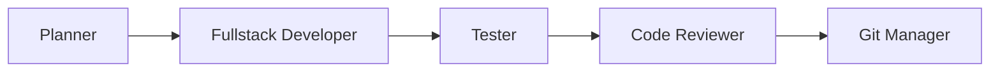

## The AI Team Model

OMGKIT's power comes from its team of specialized agents. Instead of one AI doing everything, you have experts for each domain.


## Agent Categories

<CardGroup cols={2}>
  <Card title="Core Development (6)" icon="code">
    - Planner
    - Researcher
    - Debugger
    - Tester
    - Code Reviewer
    - Scout
  </Card>
  <Card title="Operations (5)" icon="gears">
    - Git Manager
    - Docs Manager
    - Project Manager
    - Database Admin
    - UI/UX Designer
  </Card>
  <Card title="Extended (6)" icon="puzzle-piece">
    - Fullstack Developer
    - CI/CD Manager
    - Security Auditor
    - API Designer
    - Vulnerability Scanner
    - Pipeline Architect
  </Card>
  <Card title="Creative (3)" icon="palette">
    - Copywriter
    - Brainstormer
    - Journal Writer
  </Card>
</CardGroup>

<Card title="Omega Exclusive (3)" icon="wand-magic-sparkles">
  - Oracle (deep analysis)
  - Architect (system design)
  - Sprint Master (team orchestration)
</Card>

## How Agents Collaborate

### Example: Feature Development

When you run `/feature "add user authentication"`:



<Steps>
  <Step title="Planner">
    Analyzes requirements, researches patterns, creates implementation plan.

    Output: `plans/auth.md` with step-by-step tasks
  </Step>

  <Step title="Fullstack Developer">
    Implements the plan, writing code for each task.

    Output: Working code following project patterns
  </Step>

  <Step title="Tester">
    Writes unit tests, integration tests, runs coverage.

    Output: Test files with 80%+ coverage
  </Step>

  <Step title="Code Reviewer">
    Reviews code for quality, security, and best practices.

    Output: Approved code or revision requests
  </Step>

  <Step title="Git Manager">
    Creates meaningful commit with conventional message.

    Output: Clean git history
  </Step>
</Steps>

### Agent Handoff

Agents pass context to each other:

```yaml
# Handoff from Planner to Developer
from: planner
to: fullstack-developer
context:
  plan_file: "plans/auth.md"
  current_task: 1
  total_tasks: 12
  constraints:
    - "Use bcrypt for password hashing"
    - "Follow existing auth patterns in src/auth/"
```

## Agent Capabilities

Each agent has specific tools and specializations:

| Agent | Tools | Specialization |
|-------|-------|----------------|
| **Planner** | Read, Grep, Glob, Write | Architecture, task breakdown |
| **Fullstack Developer** | All file tools, Bash | Implementation |
| **Tester** | Read, Write, Bash | Test generation, coverage |
| **Code Reviewer** | Read, Grep | Quality, security review |
| **Git Manager** | Bash (git) | Version control |
| **Scout** | Grep, Glob, Read | Codebase exploration |

## Invoking Specific Agents

You can call agents directly:

```bash
# Direct agent invocation
@planner "plan the checkout flow"
@tester "write tests for UserService"
@code-reviewer "review src/auth/"
```

Or let commands route to appropriate agents:

```bash
/plan "checkout flow"      # Routes to planner
/test "UserService"        # Routes to tester
/review "src/auth/"        # Routes to code-reviewer
```

## Agent Communication

Agents communicate through structured handoffs:

<AccordionGroup>
  <Accordion title="Task Handoff" icon="arrow-right">
    ```yaml
    type: task_handoff
    from: planner
    to: fullstack-developer
    task:
      id: "auth-001"
      description: "Create User model"
      file: "src/models/User.ts"
      details: |
        Create User model with:
        - id, email, passwordHash
        - timestamps
        - validation
    context:
      plan: "plans/auth.md"
      patterns: ["existing models in src/models/"]
    ```
  </Accordion>

  <Accordion title="Review Request" icon="magnifying-glass">
    ```yaml
    type: review_request
    from: fullstack-developer
    to: code-reviewer
    changes:
      files:
        - "src/models/User.ts"
        - "src/services/AuthService.ts"
      summary: "Added user authentication"
    requirements:
      - "Security review for auth logic"
      - "Check password hashing"
    ```
  </Accordion>

  <Accordion title="Completion Report" icon="check">
    ```yaml
    type: completion_report
    from: tester
    to: project-manager
    task_id: "auth-001"
    status: completed
    metrics:
      tests_written: 15
      coverage: 87%
      all_passing: true
    ```
  </Accordion>
</AccordionGroup>

## The Sprint Master

The **Sprint Master** is a special Omega agent that orchestrates the entire team:

```bash
/team:run
```

The Sprint Master:
1. Reads the current sprint
2. Assigns tasks to appropriate agents
3. Monitors progress
4. Handles blockers
5. Manages handoffs
6. Reports status

Think of it as an AI Scrum Master that never sleeps.

## Customizing Agent Behavior

In `.omgkit/config.yaml`:

```yaml
agents:
  overrides:
    planner:
      model: "claude-opus"      # Use most capable model
      verbosity: "detailed"      # Detailed plans

    tester:
      coverage_target: 90        # Higher coverage requirement
      test_framework: "vitest"   # Specific framework

    code-reviewer:
      security_focus: true       # Extra security scrutiny
      style_guide: ".eslintrc"   # Reference style guide
```

## Best Practices

<Note>
  **Let specialists specialize.** Don't ask the debugger to write documentation or the copywriter to review code. Each agent excels in their domain.
</Note>

<Note>
  **Trust the handoffs.** Agents pass rich context to each other. The fullstack developer knows what the planner intended.
</Note>

<Note>
  **Monitor, don't micromanage.** Use `/team:status` to observe, not control every action.
</Note>

## Next Steps

<CardGroup cols={2}>
  <Card
    title="All Agents"
    icon="robot"
    href="/agents/overview"
  >
    Detailed reference for each agent.
  </Card>
  <Card
    title="Commands"
    icon="terminal"
    href="/commands/all-commands"
  >
    Commands that invoke agents.
  </Card>
</CardGroup>
